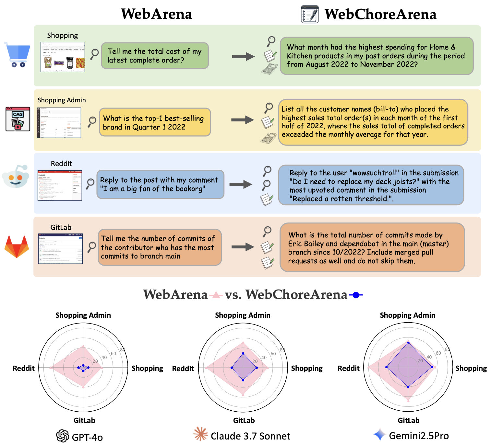
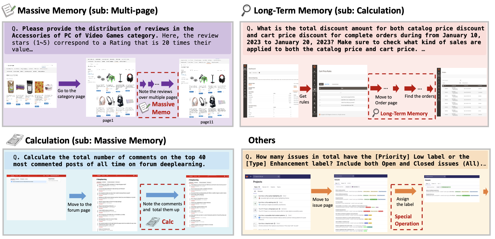

# WebChoreArena: Evaluating Web Browsing Agents on Realistic Tedious Web Tasks


<p align="center" width="100%">

</p>

<div>
<div align="center">
<br>
    <a href='https://atsumiyai.github.io/' target='_blank'>Atsuyuki Miyai</a>&emsp;
    Zaiying Zhao&emsp;
    Kazuki Egashira&emsp;
    Atsuki Sato&emsp;
    Tatsumi Sunada&emsp;
    Shota Onohara&emsp;
    Hiromasa Yamanishi&emsp;
    Mashiro Toyooka&emsp;
    Kunato Nishina&emsp;
    Ryoma Maeda&emsp;
    <a href='https://scholar.google.co.jp/citations?user=CJRhhi0AAAAJ&hl=en' target='_blank'>Kiyoharu Aizawa</a>&emsp;
    <a href='https://scholar.google.co.jp/citations?hl=ja&user=rE9iY5MAAAAJ&view_op=list_works' target='_blank'>Toshihiko Yamasaki</a>&emsp;
</div>
<div align="center">
    The University of Tokyo
    <br>
</div>


|  |
|:---|
| <p align="justify"><b>Figure 1. The Overview of The WebChoreArena Challenge.</b> WebChoreArena extends WebArena by introducing more complex and labor-intensive tasks, pushing the boundaries of agent capabilities. This enhanced benchmark allows for a clearer evaluation of progress in advanced models and reveals that even powerful models such as Gemini 2.5 Pro still have significant room for improvement.

## 🚀 News
- 2024.05: We make this codebase public.


## 📕 Abstract
As web agents become increasingly capable and demonstrate proficiency in general browsing tasks, a critical question emerges: *Can they go beyond general browsing to robustly handle tasks that are tedious and complex, or chores that humans often avoid doing themselves?* In this paper, we introduce **WebChoreArena**, a new fully reproducible benchmark comprising 532 carefully curated tasks designed to extend the scope of WebArena beyond general browsing to more labor-intensive and tedious tasks. WebChoreArena systematically integrates three key challenges: (i) **Massive Memory** tasks requiring accurate retrieval of large amounts of information in the observations, (ii) **Calculation** tasks demanding precise mathematical reasoning, and (iii) **Long-Term Memory** tasks necessitating long-term memory across multiple webpages. Built on top of the fully reproducible and widely adopted the four WebArena simulation environments, 
WebChoreArena ensures strict reproducibility and enables fair, direct comparisons with the established WebArena benchmark, offering key insights into agent progress.




## 📦 Requirements

### API KEY
We used Azure OpenAI API, Anthoropic Claude API, and Google Gemini API for the experiments. We will share the code for OpenAI API soon.

```bash
export AZURE_OPENAI_API_KEY='your-api-key-here'
export AZURE_OPENAI_ENDPOINT="your-azure-endpoint-here"
export ANTHROPIC_API_KEY='your-api-key-here'
export GEMINI_API_KEY='your-api-key-here'
```

### End-to-end Evaluation
1. Setup the standalone environment following the original [Webarena repository](https://github.com/web-arena-x/webarena/blob/main/environment_docker/README.md).
2. After evaluating each website, reset the environment to the initial state following the instructions [here](https://github.com/web-arena-x/webarena/blob/main/environment_docker/README.md#environment-reset). After the reset, run the inference for cross-site tasks.


## 📂 Code Structure
```bash
WebChoreArena/
│── figs/                # figures used across the project
│── AgentOcccam/                # Web browsing agent module
│── BrowserGym/                # Web browsing agent module
│── README.md              # Main documentation for the overall project
```
Please dive in to the project of [AgentOccam](./agentocccam/) and [BrowserGym](./browsergym/) for more details.

## 📊 Dataset
We provide dataset JSON files in either [AgentOccam/config_files](./AgentOccam/config_files) or [BrowserGym/config_files](./BrowserGym/config_files). The benchmark can be run directly without any additional downloads.
(We also provide the dataset via [Kaggle Dataset](https://www.kaggle.com/datasets/miatsu/webchorearena-json-files). You can also download via it.)


### Columns Info.

The columns in this JSON file are defined as follows:

| Column Name         | Description |
|---------------------|-------------|
| `task_id`           | Unique identifier for the task |
| `sites`             | Websites used in the task |
| `start_url`         | Initial URL where the agent begins |
| `start_url_lite`    | Simplified start URL for easier tasks |
| `strage_state`      | Path to login/session state |
| `affect_environment`| Whether the task affects the environment |
| `required_wait`     | Whether a wait is needed after task |
| `intent_template`   | Template defining task goal |
| `intent`            | Specific task goal or instruction |
| `required_obs`      | Required modalities (any/text/image) |
| `type_main`         | Main task category |
| `type_sub`          | Subcategory of task |
| `description`       | How the task should be performed |
| `instantiation_dict`| Dictionary with content for templates |
| `eval`              | Evaluation method used |

### Small Set
Running the full WebChoreArena benchmark can cost several hundred dollars in API usage. Therefore, we also provide a small subset of tasks. For each directory, the file `small_set_ids.txt` inside `config_files` specifies the task IDs used in the small subset. This subset corresponds to the one used in the subset experiments reported in Table 2 of the paper.


## ✅ Final Results


|               |                  | Shopping | Admin | Reddit | GitLab | Cross | Overall |
|---------------|------------------|----------|-------|--------|--------|--------|---------|
| **AgentOccam**| GPT-4o           | 10.3     | 4.5   | 9.9    | 7.1    | 0.0    | 6.8     |
|               | Claude 3.7 Sonnet| 27.4     | 28.8  | 23.1   | 22.8   | 7.7    | 23.5    |
|               | Gemini 2.5 Pro   | 41.9     | 42.4  | 44.0   | 38.6   | 10.8   | 37.8    |
| **BrowserGym**| GPT-4o           | 0.9      | 2.3   | 5.5    | 3.9    | 0.0    | 2.6     |
|               | Claude 3.7 Sonnet| 16.2     | 26.5  | 18.7   | 25.2   | 30.8   | 23.1    |
|               | Gemini 2.5 Pro   | 47.9     | 50.0  | 44.0   | 40.2   | 40.0   | 44.9    |


## 🤝 Acknowledgement
We adopt these codes to create this repository. We sincerely appreciate the great work/codebases.
* [WebArena](https://github.com/web-arena-x/webarena/tree/main)
* [VisualWebArena](https://github.com/web-arena-x/visualwebarena/tree/main)
* [AgentOccam](https://github.com/amazon-science/AgentOccam)
* [BrowserGym](https://github.com/ServiceNow/BrowserGym)
* [AWM](https://github.com/zorazrw/agent-workflow-memory)


## ✉️ Contact
If you have questions, please open an issue mentioning @AtsuMiyai or send an email to miyai[at]cvm.t.u-tokyo.ac.jp
